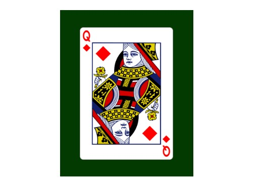
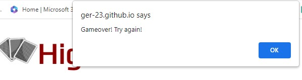

# Higher or Lower

This card-guessing game is a simple and engaging game that requires players to predict whether the next card drawn from the deck will be higher or lower than the card they are faced with. It offers a straightforward gameplay experience that appeals to a broad audience. Its accessible and quick gameplay makes it an ideal choice for some light entertainment when a person has a minutes spare or can be incorporated into a more competetitive game for family and friends.

## Features

### The Header
  - Positioned above the main game the header displays the name of the game in large letters that contrast clearly with the background. The title describes clearly the nature of the game.
  - The image is symbolic of the instruments of the game which are of course playing cards. It shows three cards with backs facing to the front.

### Main Section
 - Displays clearly the current card image against a dark green background.
 - The next card is displayed once the user makes their choice on the buttons below.

### Game Options

- The game options are the two choices mentioned in the game title: Higher or Lower. These choices are made with interactive buttons which highlight in green when hovered over and red when the choice is clicked.

### Game Results

- After a player makes their choice the game reveals the next card from the deck and increments and displays the score by one for each correct guess.
- When an incorrect guess is made the game displays a message at the top of the screen to state that the game is over and to start another game.
- A new game is started and the score reset when the 'OK' is clicked in the 'game over' alert.
- When two cards values are the same the computer displays a message at the top of the screen to state this and encourages the user to make another choice.
- The score is clearly displayed underneath the card image in clear and contrasting colours which tie in the red of the heading and the green background in the display card area.

### The Footer

- The footer is located beneath the game score.
- It is valuable as it shows the game rules and an encouraging message alluding to the nature of the game. Luck!
